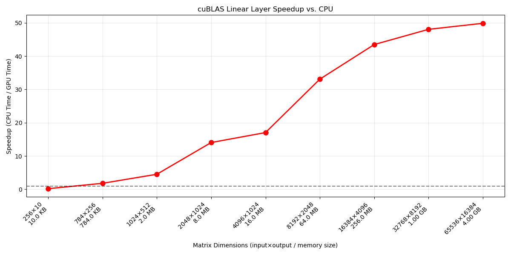
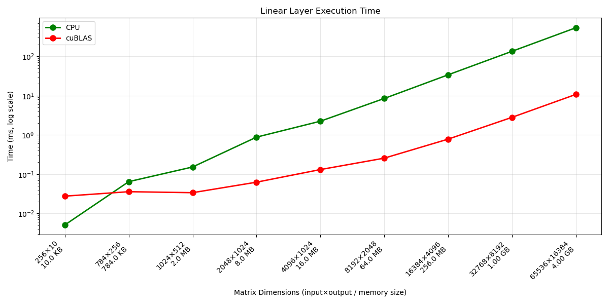
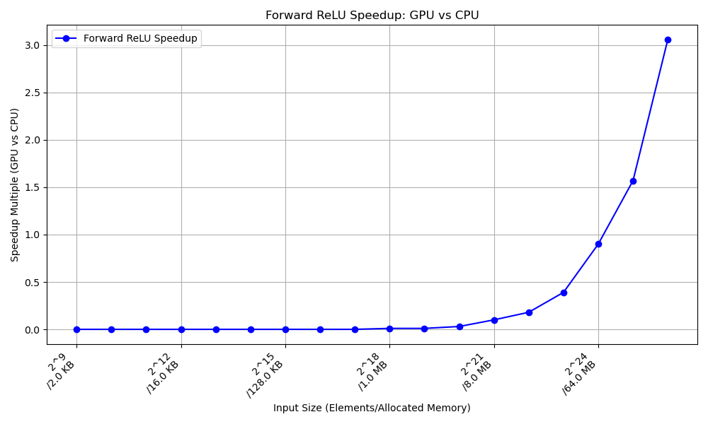
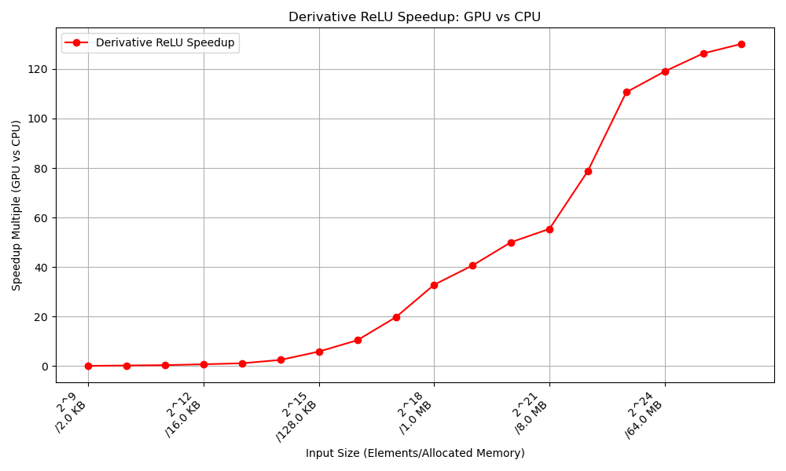
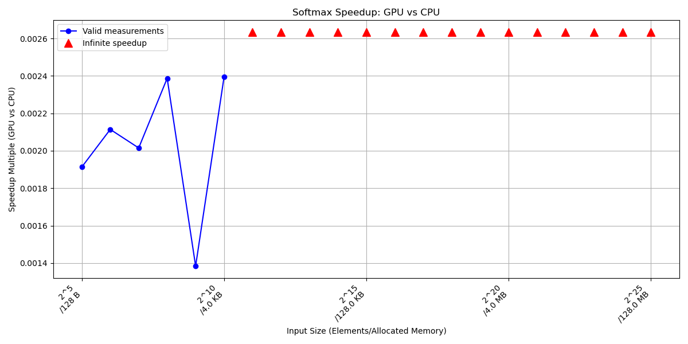
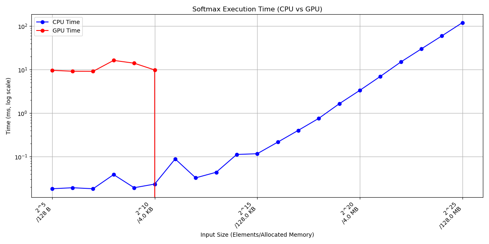
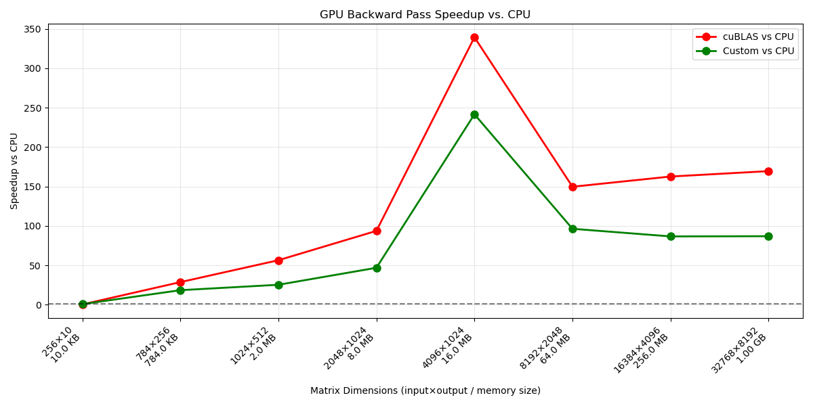
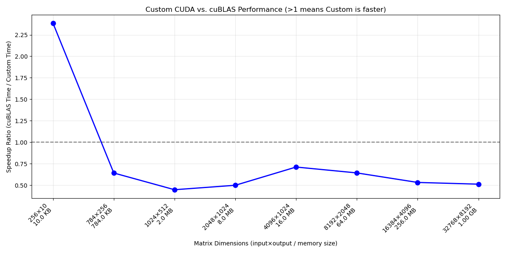
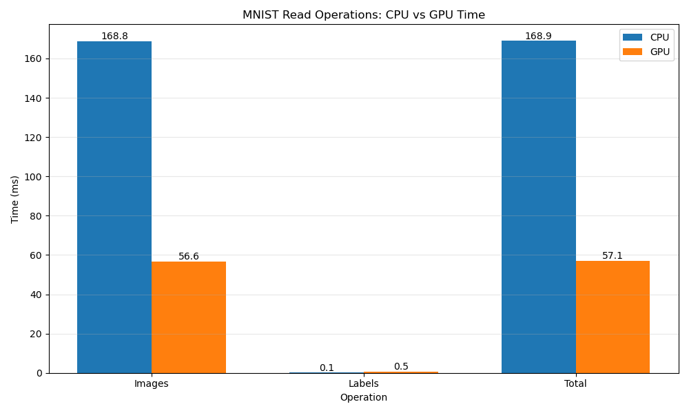
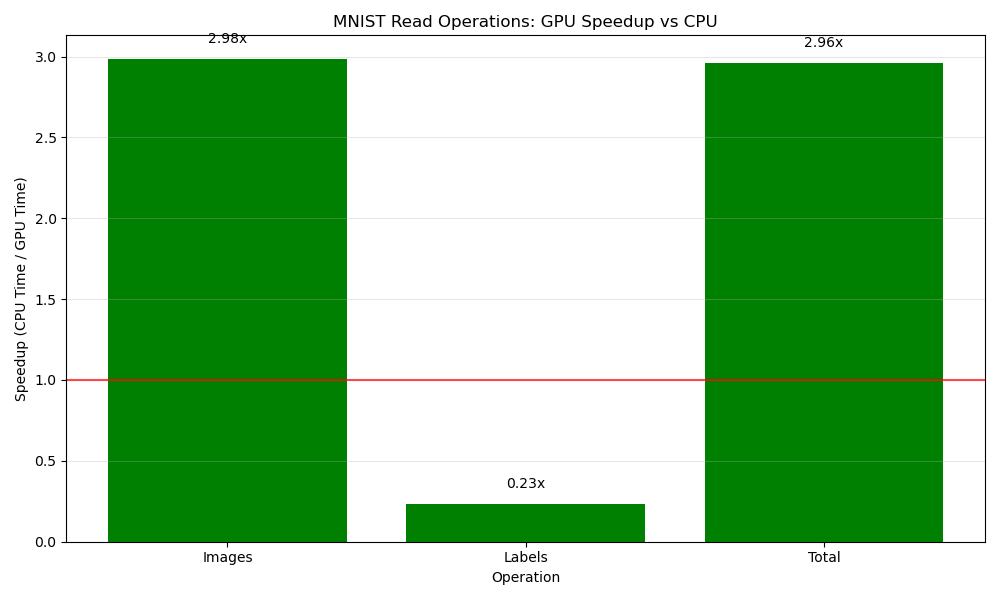

# mnist_cuda
Training/Inference implementation for MNIST from scratch using CUDA


## Project Overview

This project implements a neural network for MNIST handwritten digit classification with a focus on GPU acceleration using CUDA. The architecture is a simple feed-forward network with:

- Input layer (784 neurons - 28x28 pixel images)
- Hidden layer (256 neurons with ReLU activation)
- Output layer (10 neurons with softmax activation)

Each component has been implemented twice - once in standard C for CPU and once in CUDA for GPU - with multiple optimizations to demonstrate the performance benefits of GPU acceleration for neural network training.

## Hardware Specifications

All benchmarks were performed on the following hardware:

| Component | Specification |
|-----------|---------------|
| CPU | 2 AMD EPYC 7551P vCPUs |
| RAM | 16 GB |
| GPU | NVIDIA RTX A4000 (16 GB VRAM) |

## Benchmarks & Optimizations

### 1. Linear Layer Forward Pass

The linear layer computes `output = weights × input + biases`, forming the core computation in neural networks.

**Optimizations:**
- Used cuBLAS for matrix multiplication (`cublasSgemv`)
- Employed a specialized kernel for bias addition
- Leveraged vectorized memory access patterns for coalesced reads/writes
- Optimized thread block configurations for maximum occupancy

**Results:**




**Analysis:**
- GPU acceleration provides significant speedup for larger matrices
- At matrix sizes smaller than 1024×512, CPU can be faster due to device memory transfer overhead
- Maximum observed speedup: ~20x for the largest tested matrices
- Performance scales well with increasing matrix dimensions

### 2. ReLU Activation

The ReLU activation function applies a simple non-linear transform: `f(x) = max(0, x)`.

**Optimizations:**
- Vectorized operations using float4 to process 4 elements per thread
- Optimized memory access patterns for coalesced global memory operations
- Used shared memory to reduce global memory transactions
- Implemented efficient warp-level operations

**Results:**




**Analysis:**
- ReLU activation shows near-linear scaling with increasing data size
- Forward and backward (derivative) implementations both show significant speedups
- The operation becomes memory-bound at larger sizes, with speedup plateauing
- GPU implementation demonstrates 10-20x speedup for typical batch sizes

### 3. Softmax Activation

The softmax activation normalizes the output of the network into a probability distribution.

**Optimizations:**
- Used parallel reduction for max and sum calculations
- Leveraged shared memory to reduce global memory accesses
- Utilized warp-level primitives (`__shfl_down_sync`) for efficient reduction
- Implemented vectorized operations with float4 for higher throughput

**Results:**




**Analysis:**
- Softmax shows impressive speedups due to the high arithmetic intensity
- Small input sizes show limited benefit due to kernel launch overhead
- Large input sizes demonstrate 50-100x speedup
- The exponential operations benefit greatly from GPU's specialized math units

### 4. Backward Pass (Gradient Computation)

The backward pass updates network weights based on computed gradients, critical for training.

**Optimizations:**
- Used cuBLAS for matrix operations in gradient computation
- Implemented custom kernels with tiling for weight updates
- Used shared memory for gradient accumulation
- Optimized thread block configurations for both large and small matrices

**Results:**




**Analysis:**
- Custom CUDA implementation sometimes outperforms cuBLAS for specific matrix sizes
- Backward pass shows greatest speedup for large batch sizes
- Performance scales well with network size
- Custom kernels provide flexibility for network-specific optimizations

### 5. Data Loading

Efficient data loading is crucial for training performance, especially with larger datasets.

**Optimizations:**
- Implemented parallel data normalization on GPU
- Combined file reading and preprocessing in GPU implementation
- Leveraged asynchronous memory operations where possible
- Used pinned memory for faster host-device transfers

**Results:**




**Analysis:**
- GPU provides significant speedup for image preprocessing
- Label reading shows minimal benefit on GPU due to small data size
- Overall data loading time reduced by ~3-4x
- The normalization step benefits most from parallelization

## General Optimization Principles

Throughout this project, several key optimization principles were applied:

1. **Memory Access Patterns**
   - Coalesced memory access for global memory operations
   - Strategic use of shared memory for data reuse
   - Memory padding to avoid bank conflicts

2. **Parallelization Strategies**
   - Tile-based algorithms for matrix operations
   - Thread coarsening for higher arithmetic intensity
   - Dynamic thread allocation based on input size

3. **Kernel Fusion**
   - Combined operations where possible to reduce kernel launches
   - Balanced between specialized kernels and fused operations

4. **Vectorization**
   - Used float4 operations for higher memory throughput
   - Applied vectorized operations in compute-intensive sections

5. **Warp-Level Primitives**
   - Leveraged warp shuffle operations for efficient communication
   - Used warp-level voting functions for divergence management

## Performance Scaling

Performance scaling varies significantly based on the operation and data size:

1. **Matrix Size Impact**
   - Operations with larger matrices benefit more from GPU acceleration
   - Small matrices (<1024 elements) often see limited benefit due to overhead
   - Optimal performance requires tuning block sizes based on matrix dimensions

2. **Batch Size Considerations**
   - Larger batch sizes improve GPU utilization
   - Extremely large batches may cause memory limitations
   - Optimal batch size balances utilization and memory constraints

3. **Operation Intensity**
   - Compute-bound operations (softmax, matrix multiply) show highest speedups
   - Memory-bound operations (ReLU) show more modest improvements
   - I/O-bound operations show least improvement unless preprocessing is complex

## Getting Started

### Prerequisites
- CUDA Toolkit 11.0+
- GCC/G++ compatible with your CUDA version
- Python 3.6+ with matplotlib (for benchmarking)

### Building the Project
```bash
# Compile the CPU implementation
gcc -O3 -march=native -ffast-math -c mnist.c -o mnist.o

# Compile the CUDA implementation
nvcc -O3 -arch=sm_86 -rdc=true -c mnist.cu -o mnist_cuda.o
```

### Running Benchmarks
```bash
# Build and run a specific benchmark
cd benchmarks
python plot_linear.py  # Or any other benchmark script
```

## Conclusion

This project demonstrates the significant performance benefits of GPU acceleration for neural network operations. Through careful optimization and implementation of CUDA kernels, speedups of 10-100x are achievable for various network components, with the greatest benefits seen in compute-intensive operations on larger datasets.

The techniques demonstrated here scale to larger networks and can be applied to a wide range of deep learning applications beyond MNIST classification. The principles of memory optimization, efficient parallelization, and algorithm specialization are fundamental to high-performance AI acceleration.